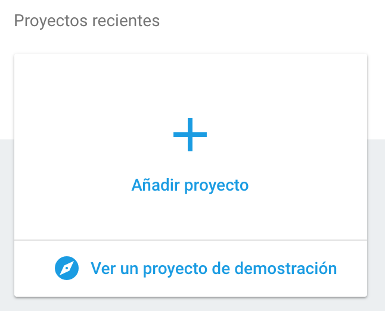

# Make a chat app in no time!
[Lesson](http://materials.ironhack.com/s/HJbWLJ0Pz)

## Learning Goals
After this lesson, you will be able to:

* Understand the importance of a backend
* To use serverless services for rapid development
* How to use Firebase realtime database
* Use jQuery to make interactive web pages
* How to publish a webApp

### Requirements
* [Fork this repo](https://guides.github.com/activities/forking/)
* Clone [this](https://github.com/ironhack/ironChat---MEX.git) repo into your `~/ironhack/` folder
* make sure you have chorme web browser installed

### Previous knowledge
* Basic understanding of javascript languaje
* Understand what a function is and how it works in javascript
* What is the DOM and how we can select a node

### Submission
Upon completion, run the following commands

```
$ git add .
$ git commit -m "done"
$ git push origin master
```

Navigate to your repo and create a Pull Request -from your master branch to the original repository master branch.

In the Pull request name, add your name and last names separated by a dash "-"

### Deliverables
The starter-code provides every resource you need to style your Chat. Please, push every thing you need to make it work properly on GitHub before creating the pull request.

## Introduction: How hard is to develop a backend?

We have heard about servers, databases, security, may be we've heard about devOps or hostings. If you want to make any website you need a server that's for sure!, you need to be concern about the safety of your data, and we also have heard that manage a database is hard, is complicated and troubling, you need an expert on data science or backend to ensure your data will be secure, and if you want to learn to make all this you need to be a nerd or some kind of super human and invest several years to learn all the stuff needed to become a backend developer.


And it's true. )=


But wait, we live in the tech era right?, we have seen all this awesome apps everywhere, this spectacular companies like Google that have been released a lot of software to make our lives easier right? there is a lot of companies and startups making amazing products that are very techy, for example shazam this company has develop an app that can identify music, movies, advertising, and television shows, based on a short sample played and using the microphone on the device.
In just one year the Shazam app had more than 100 million monthly active users, and on December 11 of 2017 Shazam was bought by Apple inc and we think: there must be really hard to make an app like this.

 

But the truth is, there is many tools today to accelerate your success, and we can make a very powerful app with very little effort. Why we use Shazam as an example?, you will see...

## 1.- Connect our App to a Firebase Project

We are going to use Firebase, Firebase is a backend as a service is one of the Google's tools in the Cloud, and it offers a lot of options to connect our web apps or mobile apps to services in the cloud, services that are a substitution of things you normally need a server (computer in some place in the world), with a backend written in any language conditioned for serves like PHP, RUBY, PYTHON, JAVA, C#, GO or many others.

### Create the Firebase Project

* Enter to the [Firebase console](https://console.firebase.google.com) make sure that you have logged in with any gmail account.
* Click in the "Add Project" button and set a cool name like "IronhackChat" and choose your country
 
* Enter to your brand new firebase project and copy the snipet for web app

* Finally we will navigate to our web app and will paste the firebase snipet into our `index.html` file in line 79, this file is inside our `starter_code` folder

### Analize the boilerplate

Open the project folder with sublime text and enter into the `starter_code` folder, once you see all the files, open the `index.html` and analyze the pieces in it. There are 3 main pieces.

## 2.- Let's login!

In order to send messages in a chat you need to identify yourself. We are going to let the user make an account into our app and use the data to identify them, but wait! are we have to fulfill this annoying forms?, na!, we are going to use social network login!

### Activate the login method in Firebase console
In the Firebase console, inside of the authentication section we clcik the "sign-in method" tab, we choose google, enable it and save.


### let's code our login
Open the `app.js` file inside the `starter_code` folder and add this fragment of code.

```javascript
var provider = new firebase.auth.GoogleAuthProvider();
var user;

$('#login_button').click(loginWithGoogle);

function loginWithGoogle(){
    firebase.auth().signInWithPopup(provider)
        .then(function(result) {
            user = result.user;
            $('.login-container').hide();
            $('.main-container').show();
   
        });
}
```
In the code above we have set 2 variables, 1 listener and 1 function to acomplish the login via Google account to avoid the horrible forms, and we have save the full user object into our variable `user`.

### Show the user info
There are several ways to save and maintain the user info, we could save it directly to the database, but for this exercise we have save it just into a variable named `user`.

Let's write this code to show the user info when Firebase deliver it to us:
```javascript

function setUser(){
    $('.users-container').html(
        `
            <li>
                
                <p>${user.displayName}</p>
            </li>
        `
    )
}
```

We also need to call this function `setUser` inside the previous function `loginWithGoogle` just right to the end:
```javascript
function loginWithGoogle(){
    firebase.auth().signInWithPopup(provider)
        .then(function(result) {
            user = result.user;
            $('.login-container').hide();
            $('.main-container').show();
            setUser();
        });
}
```


## 3.- Time to use the database
Normally in order to use a traditional database, we need to acomplish alot of stuff, but with Firebase this is very easy.

### Write into the Database
We know who wants to send the message, it time to let'em actually do it.

```javascript
$('#send_message').click(saveMessage);

function saveMessage(){
    firebase.database().ref("chat").push({
        text:$('#message_text').val(),
        photoURL:user.photoURL,
        displayName: user.displayName,
        date: Date.now()
    });
    $('#message_text').val("");

}
```
In the code above we set a listener in the button with id `#send_message` that know what to do when a user do a click action, it calls a function named `saveMessage`, this function take the value of the chat box and the data previously saved of the user and fulfill a message object, and "push" it to our database.

### Read from the Database
We successfully have written into the database, did you think this could be that easy?.
But is time to read, in a real-time database we call this, "to listen the database" we are going to write the function for that.

```javascript
firebase.database().ref("chat").on("child_added", function(snap){
    var message = snap.val();
    $('.messages-box').append(
        `
            <li class="list-group-item">
                    
                    <span>${message.text}</span>
                </li>
        `
    );
    $('.messages-box').scrollTop($('.chat-box').height() + 8000);
});
```
We are specifying the ref of our database from what we want to listen, and we want to receive any data from this ref when a child is added, the  `child_added` event is the right Firebase tool to achieve this, we are using the back quotes for passing the html we need to draw on the page.

## Conclution
Firebase is a shortcut to develop an app the fastest, if you are thinking about performance and number of clients in real-time, remember Shazam and its thousands of users?, well, Shazam is using Firebase.

## Bonus
You can read the Firebase documentation to learn how to deploy our app into a public free domain.
[How to deploy on Firebase](https://firebase.google.com/docs/hosting/deploying?hl=es-419)

## Extra Resources
* [What is Firebase?](https://elandroidelibre.elespanol.com/2016/05/firebase-plataforma-desarrollo-android-ios-web.html)
* [Who is using Firebase](https://firebase.google.com/use-cases/)
* [Backend as a service](https://es.wikipedia.org/wiki/Backend_as_a_service)


